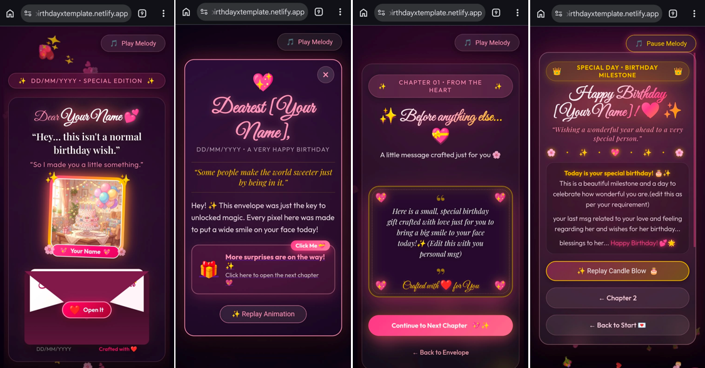
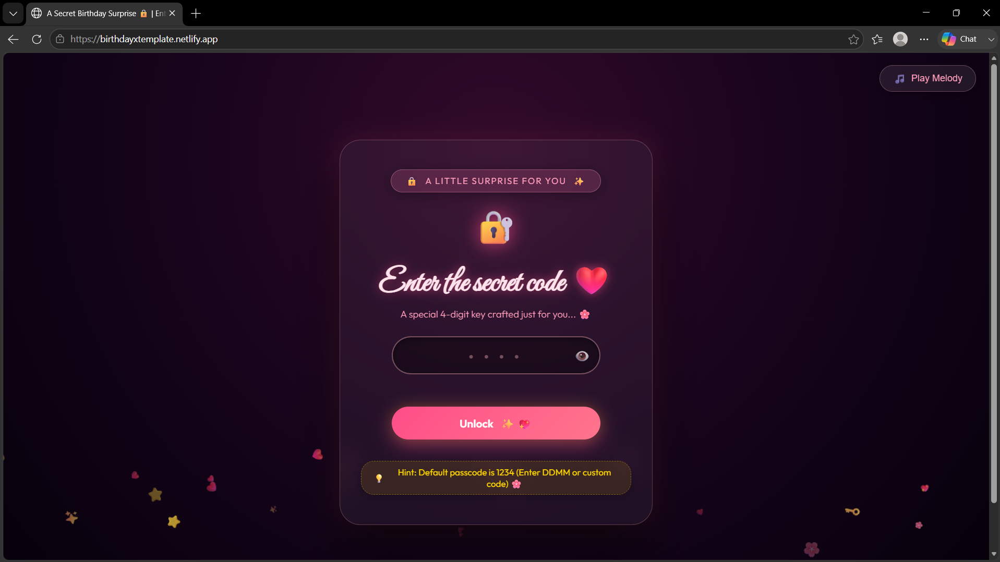
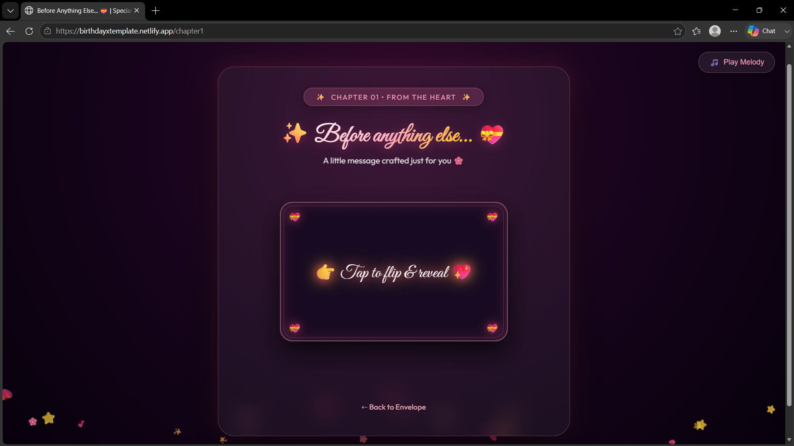
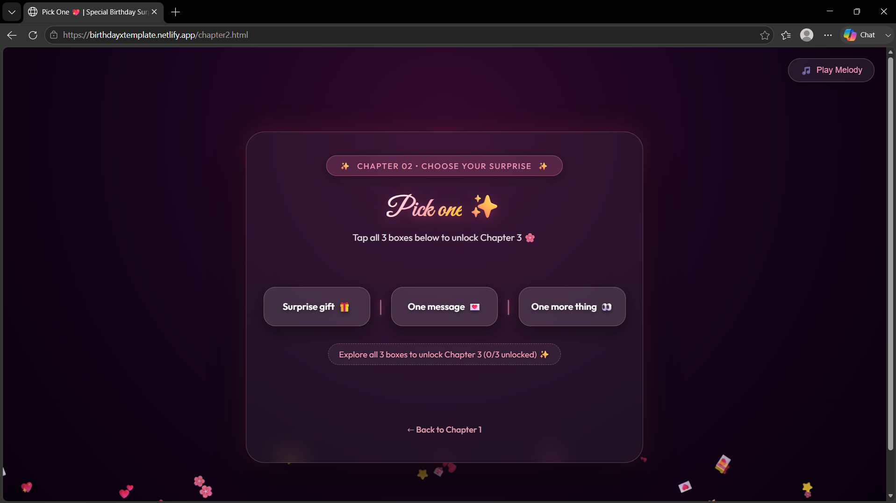
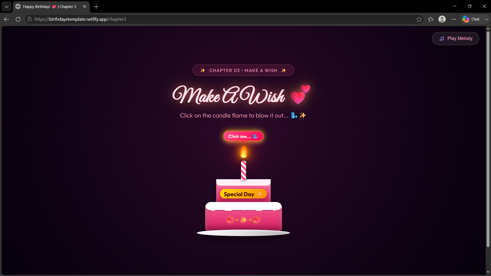

# 🎂 Interactive Birthday Surprise Website

A customizable interactive birthday surprise website template built using **HTML, CSS and JavaScript**.

Create a personalized birthday experience with animated pages, messages, surprises and interactive elements.

## ✨ Features

- 🎁 Interactive birthday surprise flow
- 💌 Personalized message sections
- 🎂 Animated cake and birthday reveal
- 📸 Photo showcase section
- 🔐 Simple login/welcome screen
- 📱 Responsive design for mobile and desktop

## 🛠️ Technologies Used

- HTML
- CSS
- JavaScript

## 📸 Preview

### Web preview

### Login page

### Chapter preview
#### Chpater 01

#### Chpater 02

#### Chpater 03

## 🚀 How to Customize

1. Replace sample images with your own images
2. Update name, date and messages
3. Modify animations and styles
4. Deploy using Netlify or GitHub Pages

## 🌐 Live Demo

https://birthdayxtemplate.netlify.app

## 📌 Purpose

This project was created as a reusable birthday surprise website template that can be customized for different occasions.